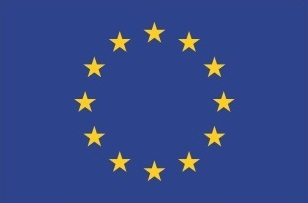

# NLG Metric Usage
Accepted to INLG 2024, ArXiv preprint [here](https://arxiv.org/abs/2408.09169)

This repository contains the data and code for examining the usage of metrics for NLG in 2023 papers presented at INLG and ACL Generation Track.

The attached jupyter notebooks were run on Google Colab.

 This work was co-funded by the European Union (ERC, NG-NLG, 101039303) and Charles University projects GAUK 40222 and SVV 260 698.